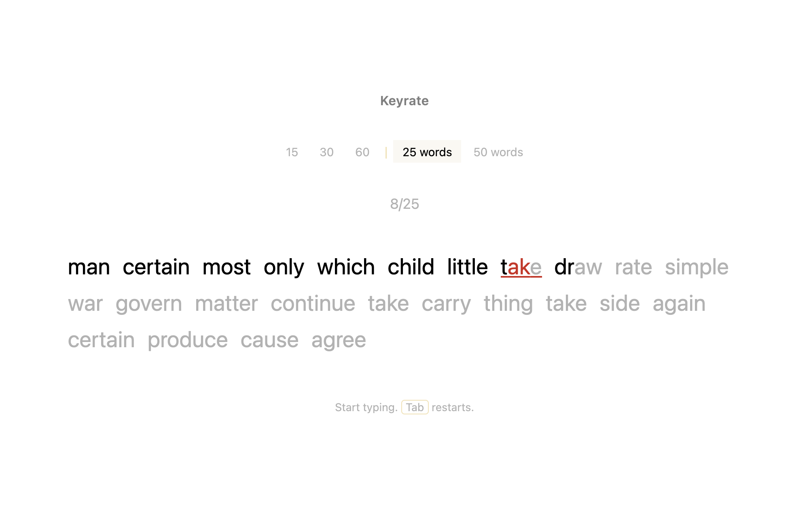
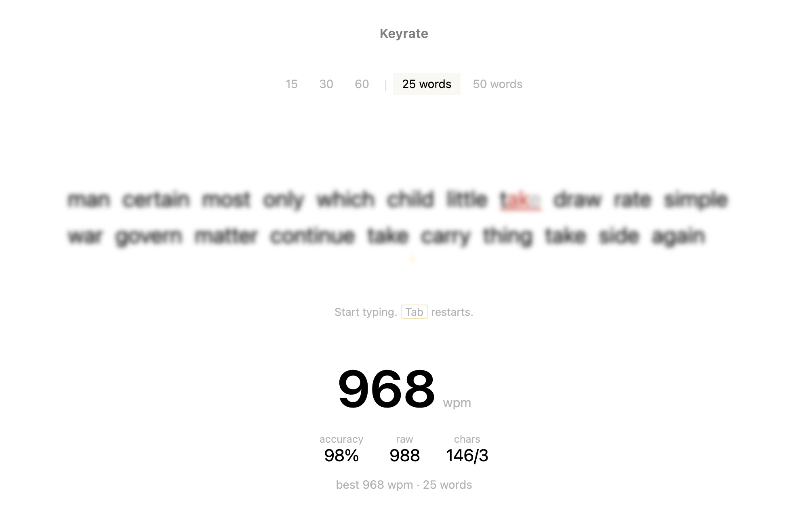
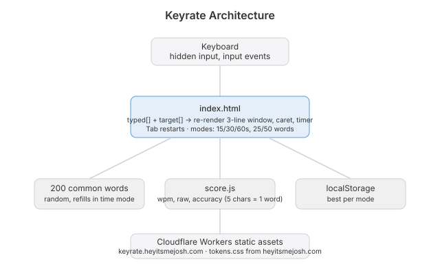

# Keyrate

  [](https://github.com/nulljosh/keyrate)

How fast do you type? Every site that answers wants an account, a theme picker and forty settings before it shows you a number.

That's the gap.

## What it does

Words appear. You type them. The clock runs out and you get one number.



Wrong letters go red. Backspace into a bad word to fix it. Tab restarts. Your best per mode stays in the browser and nowhere else.



## Why this and not Monkeytype

Monkeytype is great. It is also a settings page with a typing test attached. This is the test with nothing attached. One page, one script, no build step.

## Run it

```
15 / 30 / 60 seconds, or 25 / 50 words
Tab            restart
Enter          restart after a result
```

```
node --test
npx wrangler deploy
```

Live at [keyrate.heyitsmejosh.com](https://keyrate.heyitsmejosh.com).

## Architecture


