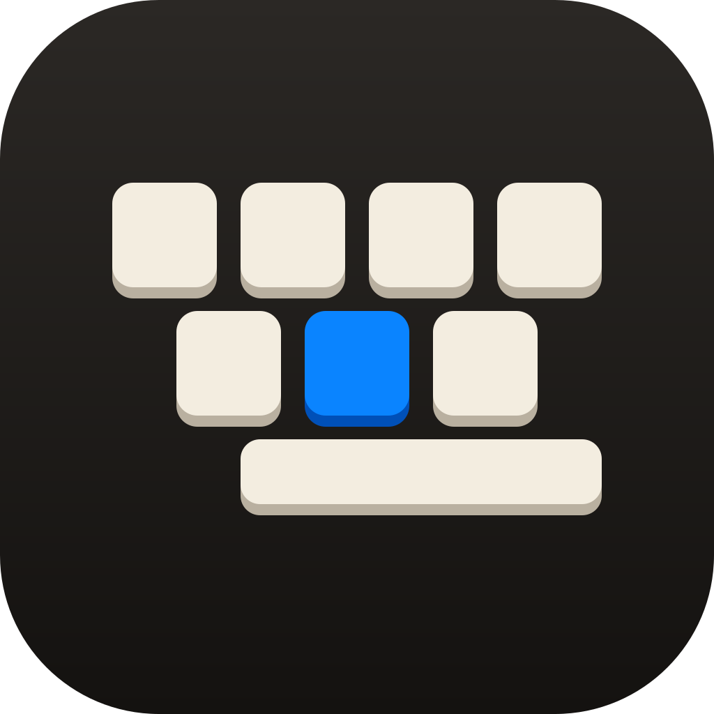
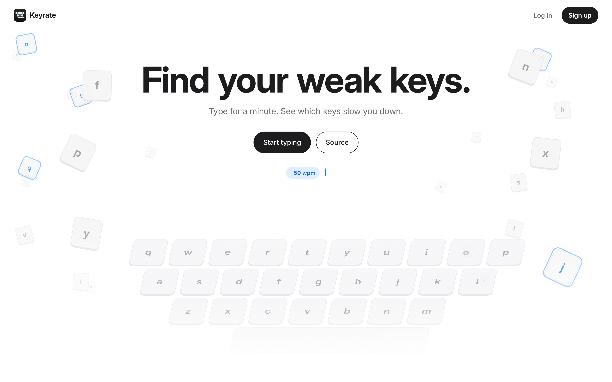
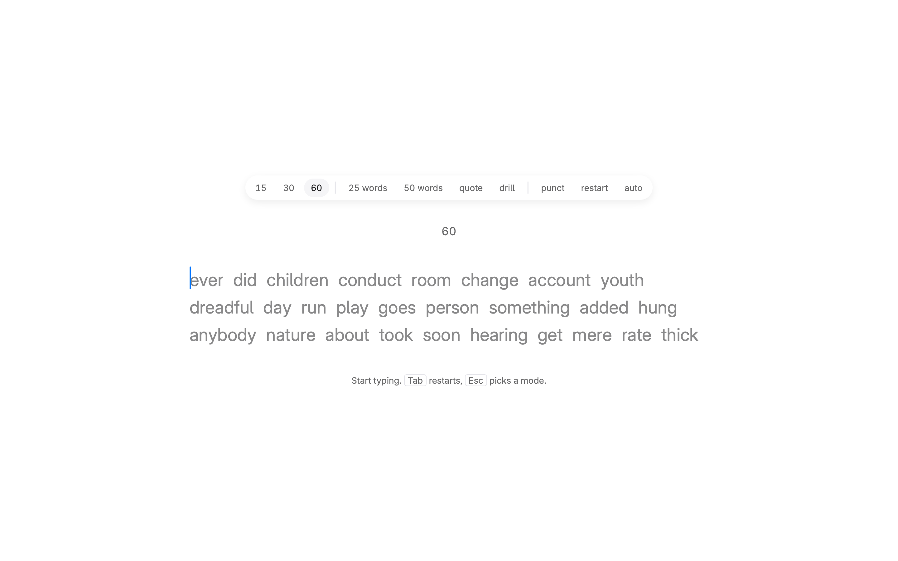
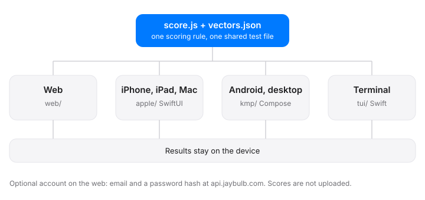

 [](https://github.com/nulljosh/keyrate/actions/workflows/test.yml) 

A typing test that shows you which keys slow you down. Free at [keyrate.jaybulb.com](https://keyrate.jaybulb.com).

<picture>
  <source media="(prefers-color-scheme: dark)" srcset="docs/images/landing-dark.png">
  
</picture>

## Features

- **Your five worst keys, lit.** The result draws a keyboard with the keys you miss most in blue. A slip you fixed still counts.
- **Speed, second by second.** A line of your words per minute across the run, with raw speed beside it.
- **Words of its own.** The thousand most common words across twenty public domain novels, plus quotes from writers long out of copyright.
- **Seven modes.** 15, 30 or 60 seconds, 25 or 50 words, a quote, or a drill built from the keys you miss most. Punctuation and numbers optional.
- **Light, dark or auto.** Follows your device, or pick one.
- **An account if you want one.** Email sign up on the web. Your results stay on your device either way.

<picture>
  <source media="(prefers-color-scheme: dark)" srcset="docs/images/typing-dark.png">
  
</picture>

## Platforms

| Where | Folder | Status |
|---|---|---|
| Web | `web/` | Live, 2.4.0 |
| iPhone, iPad, Mac | `apple/` | 2.5.0; resubmitting to the App Store |
| Android, Windows, Linux | `kmp/` | Builds, not released |
| Terminal | `tui/` | Builds |

Every port checks itself against `tests/vectors.json`, so a score means the same thing everywhere.

## Run it

```sh
node --test tests/*.test.mjs       # scoring, rules, word list, vectors
cd web && python3 -m http.server   # the site at localhost:8000
scripts/check.sh                   # node, Kotlin, Xcode and README links
```

CI runs the web, Kotlin, Swift and terminal checks on every push. A pushed `vX.Y.Z` tag becomes a GitHub release. Deploy: `npx wrangler deploy`.

iPhone, iPad and Mac: `cd apple && xcodegen generate && open Keyrate.xcodeproj`. Android and desktop: `cd kmp && ./gradlew :composeApp:run`. Terminal: `swift run --package-path tui keyrate-tui`.

## Architecture



More in [docs/ARCHITECTURE.md](docs/ARCHITECTURE.md), the reasoning in [docs/WHITEPAPER.md](docs/WHITEPAPER.md), the brand in [web/brand/BRAND.md](web/brand/BRAND.md), what's next in [roadmap.md](roadmap.md).

## License

Apache 2.0. Copyright 2026 Joshua Trommel.
